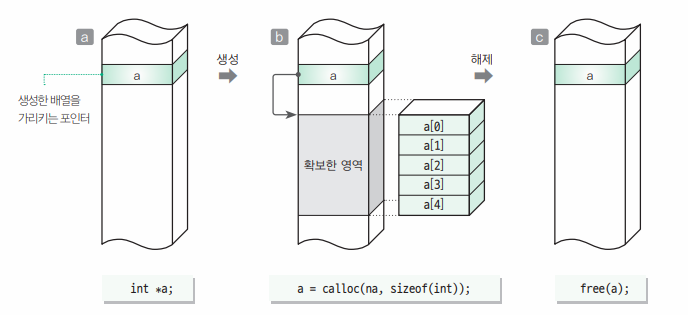
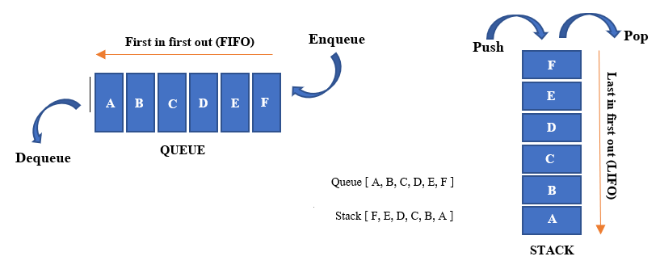
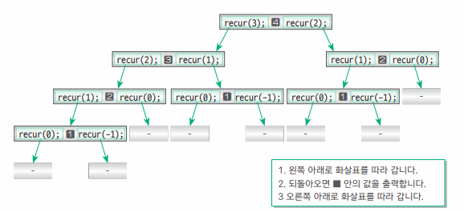
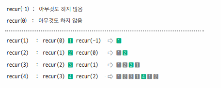

# iot-algorithm-2026
IoT개발자 과정 자료구조/알고리즘 리포지토리

## 개요

### 자료구조

- 정의
    - 데이터를 구성하는 구조. 데이터를 원하는 요구에 따라 처리할 때 효율적으로 처리하기 위해서
    - 자료(Data) + 구조(Structure) -> DataStructure
    - 자료형(DataType) : int, double, char... 
    - 자료구조(DS) : 배열, 구조체 이후 
    - 주소록 -> 구조체로 구성된 배열(크기 고정), `구조체 포인터`(크기 동적 조정가능)

- 종류
    - 단순형 : 문자, 정수, 실수, 문자열 ...
    - 선형 : 배열, `리스트`, `스택`, `큐`
    - 비선형 : `트리`, `힙`, `그래프`
    - 파일 : 순차파일, 색인파일 ...

### 알고리즘

- 정의
    - 프로그램 : 데이터를 처리하는 소프트웨어
    - 데이터를 처리할 때 문제를 해결하는 논리적인 방법과 순서

- 필요요건
    - 입력 : 알고리즘 외부에서 제공되는 자료가 필요
    - 출력 : 최소 1개 이상의 결과 도출 필요
    - 명확 : 각 단계가 애매함이 없어야 함
    - 유한성 : 유한한 횟수를 거친 후 문제 해결, 종료
    - 효과성 : 유한한 시간안에 수행할 수 있을 정도로 단순

- 복잡도 - 시간과 메모리를 얼마나 소모하는지 효율성을 따지는 척도
    - `시간 복잡도` : 자료수 n이 증가할때 시간이 얼마만큼 증가하는지 판단
    - 공간 복잡도 : 자료수 n이 증가할때 컴퓨터 메모리를 얼마만큼 사용하는지 판단. 임베디드/펌웨어에서는 중요

- 종류 - 자료구조를 가지고 해결하는 방법
    - `정렬` : 삽입, 선택, 버블, 쉡, 퀵, 병합, 힙 ...
    - `재귀` 알고리즘
    - `탐색` : DFS(깊이 우선 탐색), BFS(너비 우선 탐색), 이진 탐색
    - 문자열 `검색` : 부루트-포스, KMP, 보이어-무어...
    - `그래프` : 다익스트라, 벨먼-포드, A*
    - 그리디 알고리즘, 백트래킹, 분할 정복    
    - 동적계획법 : 메모이제이션
    - 인공지능 : 신경망, SVM(서포트 벡터 머신), 회귀분석, ...
    - 운영체제 : 세마포어, 뮤텍스, 데드락, 멀티태스킹, 멀티스레드
    - 네트워크 : QoS, 라우팅, ...
    - 암호화 : AES, DES, SEED, MD5, RSA...

- 참조웹사이트
    - https://blog.amigoscode.com/p/11-data-structures-every-developer

- 개발시 어떤 자료구조와 알고리즘을 쓰는게 효과적인지 습득해야함

### 자료구조/알고리즘 예제

1. 알고리즘 핵심
    - 순서도[text](Basic/Solution01/App02/App02.c)

2. 자료구조
    - 배열 : 같은 자료형의 묶음
    - 동적할당 : [text](Basic/algorithm01/App03/main.c)
    - 포인터 : [소스](./Basic/algorithm01/pointer01/main.c)

3. 메모리 구조
    - 코드영역 - 소스코드 저장되는 분
    - 데이터 영역 - 전역, 정적 변수 할당. 프로그램 시작 시 할당되고, 프로그램 종료 시 메모리 해제 
    - 스택 영역 - 함 수 호출 시 생성되는 지역변수, 매개변수 저장, 함수 호출 완료시 메모리 해제
    - 힙 영역

4. 알고리즘
    - 난수 [text](Basic/algorithm01/app04/main.c)
    - 소수 [text](Basic/algorithm01/app06/main.c)
        - 같은 답을 얻는 알고리즘은 하나가 아님
        - 더 좋은 알고리즘을 사용하면 속도이득 가능

### 검색
1. 검색 - search, 데이터 집합에서 원하는 값을 가진 요소를 찾아내는 것
2. 선형 검색
    - 배열의 모든 요소를 순차적으로 검색
    - 찾는 요소가 없으면 배열의 마지막까지 비교 - 단점
3. 이진 탐색
    - 데이터가 정렬된 상태에서 진행
    - 선형검색보다 빠름
4. 복잡도(complexity)
    - 시간복잡도 : 실행에 필요한 시간을 평가
    - 공간복잡도 : 기억영역, 파일 공간 등 물리적인 공간을 평가
    - 복잡도 표현 함수 : O()로 표현
    - 선형탐색 시간복잡도 : $O(n)$
    - 이진탐색 시간복잡도 : $O(log n)$
    - 시간복잡도 일반적 사용

        |시간복잡도|의미|비고|
        |:--|:--|:--|
        |$O(1)$|상수 시간| 입력크기와 관계없이 항상 일정횟수 실행|
        |$O(log n)$|로그 시간| 반복문안의 로직으로 반복횟수가 $\frac{1}{2}$씩 줄어들때, $1$ -> $\frac{1}{2}$ -> $\frac{1}{4}$ -> $\frac{1}{8}$ ... 문제 크기를 절반씩 줄이며 실행 |
        |$O(n)$|선형 시간 | 단일 반복문, 입력 크기만큼 한 번 순회|
        |$O(n log n)$|선형 로그시간 | n번 반복하면서 내부에서 log n연산 수행, 분할정복 기반 정렬 등 사용|
        |$O(n^2)$| **이차 시간**| 이중 반복문, 이 이상은 실무에서 나오면 속도가 아주 느려짐 |
        |$O(n^3)$| 삼차 시간| 삼중 반복문 |
        |$O(n k)$| 선형x다른변수 | n과 k가 독립변수일때. 문자열 비교 n개 x 길이 k 문자열 배열 처리... |
        |$O(2^n)$| 지수 시간 | 재귀! 모든 부분집합 탐색 등 |
        |$O(n!)$ | 팩토리얼 | ... |

    - 예 : n이 30이면
        |시간복잡도|연산횟수|
        |:--|--:|
        |$O(1)$|1|
        |$O(log n)$|1.48, 약 5|
        |$O(n)$| 30|
        |$O(n log n)$| 30 x 5 = 150|
        |$O(n^2)$| 30 x 30 = 900|
        |$O(n^3)$| 30 x 30 x 30 = 27,000|
        |$O(n k)$| k=30, 30 x 30 = 900|
        |$O(2^n)$| $2^30$ = 1,073,741,824|
        |$O(n!)$ | 30! = 약 2.65 x $10^32$|
    - 공간복잡도
        - $O(1)$ - 변수 몇 개
        - $O(n)$ - 1차원, 배열, 재귀함수
        - $O(n^2)$ - 2차원 배열

5. beearch() 표쥰라이브러리 이진검색 함수 존재
    - 두 값 비교를 위한 함수포인터용 비교함수를 작성해야 함
    - p123 이후 참조

### 스택과 큐

1. 스택 [소스](Basic/algorithm02/app3/main.c)
    - 접시를 쌓는 구조와 동일한 자료구조
    - 먼저 들어간 데이터는 나중에 들어간 데이터가 나와야 꺼낼 수 있다(LIFO - last in first out)
2. 스택 용어 [소스](Basic/algorithm02/app3/IntStack.h)
    - psuh : 스택에 데이터를 넣는 작업
    - pop : 데이터를 꺼내는 작업
    - bottom : 스택의 가장 바닥에 있는 데이터를 읽어옴
    - top : 스택의 가장 위의 데이터를 읽음
3. 큐 [소스](Basic/algorithm03/app01/main.c)
    - 한쪽에서 데이터를 넣고 반대쪽에서 꺼내는 자료구조
    - FIFO
4. 큐 용어
    - enqueue : 데이터 삽입
    - dequeue : 데이터 추출
    - front : 맨 앞 자리 데이터
    - rear : 맨 뒷자리 데이터
5. 큐를 배열로 구현시 단점
    - dequeue 작업시 모든 뒷자리를 재배치 해야함
    - 그래서 보통 연결리스트나 원형큐로 구현함
6. 원형큐 [소스](Basic/algorithm03/app01/main.c)
    - 일반큐 단점(빈자리 없애기 추가 로직)을 없앤 큐
    - (front + i ) % max 에 대해서 이해할 것

### 재귀 알고리즘 
1. 의미
    - 함수나 자기 자신의 함수를 호출하여 더  작은 하위 문제를 해결하는 기법
2. 팩토리얼 [소스](Basic/algorithm03/app02/main.c)
3. 재귀 분석 [소스](Basic/algorithm03/app04/main.c)
    - 상향식 - 함수의 시작부터 트리 형식으로 분석함 
    
    - 하양식 - 처음 함수가 종료되기 시작하는 시점부터 분석
    
4. 재귀알고리즘 비재귀적으로 변경 [소스](Basic/algorithm03/app05/main.c)
    - 재귀호출이 처리속도를 느리게 만드는 경우가 많음
    - 비재귀적으로 변경하면 속도 향상에 도움
5. 메모이제이션
    - 특정조건(재귀, 동일한 부분문제 반복, 입력크기 규모)에서 매우 강력한 성능 향상 기법
    - 이미 계산한 결과를 저장해두고 불러와서 계산 횟수 감소
    - 시간복잡도를 줄이고 공간복잡도를 사용
### 정렬 알고리즘
1. 데이터를 기준값에 따라 오름차순, 내림차순으로 정렬하는 것
    - 참고 사이트: [주소](https://visualgo.net/en)
2. 버블정렬 [소스](./Basic/algorithm04/app02/main.c)
    - 이웃한 두 요소의 대소관계를 비교하여 변환하여 정렬
    - 시간복잡도 : $O(n^2)$
3. 선택정렬 [소스](Basic/algorithm04/app3/main.c)
    - 가장 크거나 작은 수를 먼저 선택하여 끝과 앞에 차례대로 쌓음
    - 가장 크거나 작은 위치의 배열 인덱스를 저장하는 변수를 활용
    - 시간복잡도 : $O(n^2)$
4. 삽입정렬 [소스](Basic/algorithm04/app04/main.c)
    - 다른 배열에 값을 순서대로 삽입하여 정렬
    - 시간복잡도 : 평균 - $O(n^2)$ 최악 - $O(n^2)$ 최선 - $O(n)$
5. 셸정렬
    - 삽입정렬을 멀리 떨어진 간격으로 수행한 뒤 점점 간격을 줄여가는 방식
    - 시간복잡도 : 평균 - $O(N^{1.3})$~$O(N^{1.5})$ 최악 - $O(n^2)$ 최선 - $O(n log n)$
6. 퀵정렬
    - 기준값을 정하고 , 작은 값은 왼쪽, 큰 값은 오른쪽으로 나눠서 재귀적으로 졍렬 
    - 시간복잡도 : 평균 - $O(n log n)$ 최악 - $O(n^2)$ 최선 - $O(n log n)$
7. 병합정렬
    - 데이터를 잘게 쪼갠 후 각각 정렬 병합 하여 정렬
    - 시간복잡도 : 평균 - $O(n log n)$ 최악 - $O(n log n)$ 최선 - $O(n log n)$
8. 정렬 빠른 순서
    - 실제 세상인 경우 퀵>병합>쉘>삽입>선택>=버블 순서임
    - 최악의 경우 병합>퀵>=쉘>=삽입>=선택>=버블 순서임
    - 최선인 경우 삽입>병합>=퀵>=쉘>선택>=버블
### 문자열 검색

### 연결리스트

### 트리

### 해시
